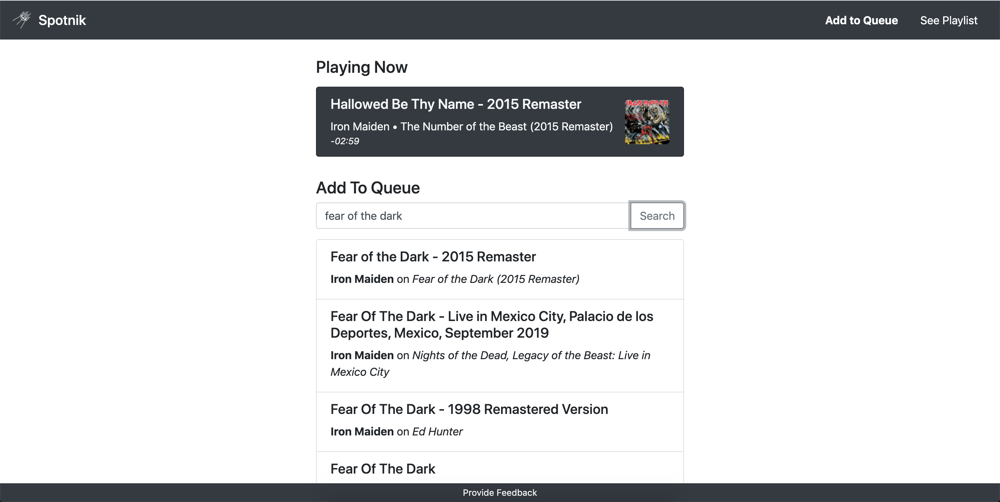
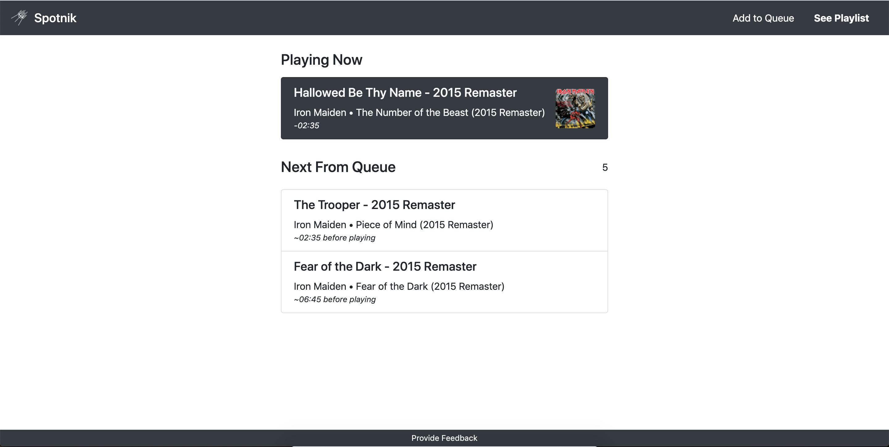

# Spotnik

A collaborative playlist app that makes sure everyone gets to hear their song. The order of the playlist is enforced by Spotnik, no skipping songs and no jumping the queue are allowed.

Features:
- Search for and collaboratively queue songs available on Spotify
- Visualize the queue with the expected playtime of each song
- Add a fallback playlist from which to play songs once the queue is empty
- Autoplay songs if the queue is empty and no fallback playlist has been set.

## Preview



## How to build & run locally
Pre-requisites: a spotify premium account, a jdk installed on your computer, as well as maven, docker, nodejs and angular-cli.

1) Register a new app on Spotify's dev portal. Write down the app ID and the app secret.
2) You'll need to expose port 8080 to the outside world (Tip: use `ngrok` to expose localhost to the outside world easily). Once exposed, write down the host that allows you to ping the backend (e.g. https://d1213209f.ngrok.io).
3) Update the `SPOTIFY_APP_ID`, `SPOTIFY_APP_SECRET`, `REDIRECT_HOST`, `ADMIN_USERNAME` and `ADMIN_PASSWORD` environment variables in the `docker-compose.yaml` file.
4) Whitelist the redirect URI on Spotify's dev portal. This should be the `REDIRECT_HOST` appended with `/authorize` (which based on the prevous example would give https://d1213209f.ngrok.io/authorize).
5) Run `./Spotnik/build_image.sh` and `./frontend/spotnik/build_image_dev.sh`
6) Run `docker-compose up` in the same directory as the docker-compose file.
7) Log in to Spotify by accessing `localhost:8080/admin/login`. Credentials will be prompted, those can be configured in the docker-compose file. Let Spotify know which device you want to use by playing any random song for a few seconds (make sure that you are logged with your account).
8) Start queuing songs by accessing `localhost` in your browser (or by using the ngrok tunnel if set up it previously).

## How to run locally, the accessible guide

1) Download and install [Docker Desktop](https://hub.docker.com/).
2) Download the [docker-compose.yaml, Spotnik-Backend and Spotnik-Frontend](https://drive.google.com/open?id=1D7nBAQry2kMSwdGLxTV27EZoYd3NNPEh) files, and put all of them together in the same directory.
3) Download [ngrok](https://ngrok.com/) in order to allow outside connections to your computer. Update the ngrok configuration (located at `$HOME/.ngrok2/ngrok.yml`) by adding the following:
```
tunnels:
	spotnik-backend:
	  addr: 8080
	  proto: http
	spotnik-frontend:
	  addr: 80
	  proto: http
```
4) Run `ngrok start --all`, and write down the tunnels links redirecting to localhost:80 and localhost:8080 (e.g. `https://9ac2269d.ngrok.io`). The tunnel redirecting to localhost:80 will allow other users to load the frontend from their devices (give them that address!), and the tunnel redirecting to localhost:8080 will be used by Spotify.
5) Create a [Spotify integration](https://developer.spotify.com/dashboard/login), and update its redirect uri on by appending `/authorize` to the address of the tunnel redirecting to localhost:8080. It should look like this: `https://f430ef88.ngrok.io/authorize`. Take this opportunity to write down the Client Id and Client Secret of your integration.
6) Update the docker-compose.yaml file environment variables:
	- Update `SPOTIFY_APP_ID` and `SPOTIFY_APP_SECRET` with the Client Id and the Client Secret from the previous step.
 	- Update `REDIRECT_HOST` with the address of the tunnel redirecting to `localhost:8080` (don't add `/authorize` here).
	- Update `ADMIN_USERNAME` and `ADMIN_PASSWORD` to whatever you'd like - just remember what you put in there.
7) Open a terminal where the spotnik-backend.tar and spotnik-frontend.tar files are located, and run `docker load --input spotnik-backend.tar` and `docker load --input spotnik-frontend.tar`.
8) Run `docker-compose up`. Spotnik is starting!
9) Wait for Spotnik to finish loading (it will be ready for use when you see `Unable to send GetActiveTrack request, no access token` in the logs).
10) Go to `http://localhost:8080/admin/login` in your browser. It will prompt for the admin credentials you configured earlier, and redirect you to Spotify in order to log in with your account.
11) Let Spotify know which device you want to use by playing any random song for a few seconds (make sure that you are logged with your account).
12) That's it, you're all set! Open your browser, and go load the frontend by going to the address of the tunnel redirecting to localhost:80.

The following admin endpoints are available (some of these endpoints are available through the electron Admin app - no readme for this one, sorry - Google is your friend).
- GET `http://localhost:8080/admin/login` in order to log in with your Spotify account.
- GET `http://localhost:8080/admin/logout` in order to log out.
- GET `http://localhost:8080/api/admin/queue/next` to admin skip a song.
- POST `http://localhost:8080/api/admin/playlist?uri={spotifyPlaylistURI}` to set a fallback playlist. If no song is queued, songs will be played from this playlist. The URI can be found in the `Share > Copy Spotify-URI` menu of a playlist (remove `spotify:playlist:` from the URI when passing it to Spotnik.)
- DELETE `http://localhost:8080/api/admin/playlist` to delete the fallback playlist.

## Possible Improvements
- Fix all the vulnerabilities in the frontend/admin-app
- Improve the test suite with integration tests
- Defluxify the app - keep it contained to the webclient
- Update the coding style to google java code style
- Look at possible code improvements with a fresh eye
- Require users to log in (e.g. in order to limit the amount of songs present in the queue, etc...)
- Allow users to vote on songs
